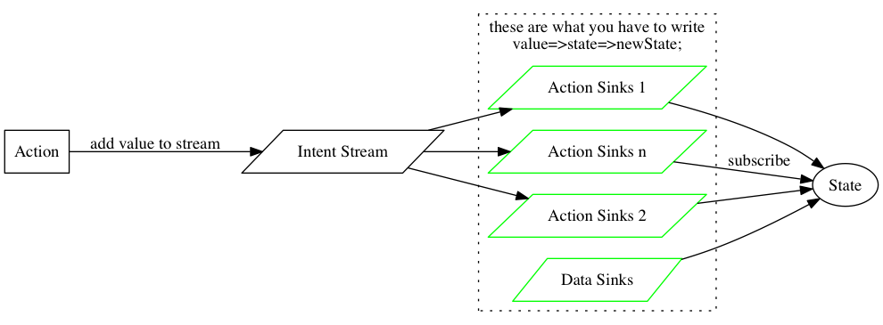

# React Most
A Monadic Reactive State Container for React Components

## What
Most is very high performance Monadic reactive streams lib. Rich User Interaction App is natively fit for Reactive Programming.

React is awesome for writing UI Components.

so, `react-most` will make you React Components Reactive.

`react-most` is simple and only 90 lines of code. only depends on most and react.

data flow is simple and one way only


- **Action** will generate value and add it into `Intent Stream`
- **Sink** create new Stream based on action type in `Intent Stream`
- **Sink** transform a value Stream into a `oldState=>newState` mapping Stream
- **State** subscribe to **Sinks** changes

## Why

Redux is awesome, but if you're big fan of Functional Reactive Programming, you would've imaged all state, user events, actions and data are Streams, then we can map,filter,compose, combine those streams to React state stream. How awesome will it be.

## How
there's only 3 things you should notice when using `react-most`

### 1. Component Wrapper
```html
import Most from 'react-most'
<Most>
  <YourApp />
</Most>
```
### 2. Define How to connect Component and Streams

```js
import {connect} from 'react-most'
import most from 'most'
let RxApp = connect(App, function(intent$){
  let search$ = intent$.filter(x=>x.type=='search');
  let defaultState$ = most.never().startWith({
    todos: [
      {id:0, text:'Loading...dadada', done:false},
    ],
    filter: id,
  }).map(defaultState=>(_=>defaultState));

  let dataSink$ = most.fromPromise(rest(remote))
                              .map(x=>JSON.parse(x.entity))
                              .map(data=>_=>({todos: data}));

  let searchSink$ = search$.debounce(500).map(x=>x.text.trim()).filter(search=>!!search).map(search=>(
    state=>({
      filter: x=>x.filter(todo=>{
        return !!search.toLowerCase().split(' ').filter((word)=>{
          return !!todo.text.toLowerCase().split(' ').filter(w=>w==word).length
        }).length
      })})))

  return {
    search: (text)=>({type:'search', text}),
    defaultState$,
    dataSink$,
    searchSink$,
  }
});
```
here are things you may need to pay attention to:

#### 2.1. `connect` you `App` to the intent transformer
```html
import Most from 'react-most'
<Most>
  <YourApp />
</Most>
```
#### 2.2. transform intent stream to state mapper stream

the transformer accept a Intetent Stream `intent$`(by convention, all Stream type variable name with suffix $), and create and return new Intent Streams(here we call those new stream -- `sinks`)

```js
  let search$ = intent$.filter(x=>x.type=='search');
```

  here we filter out only search intent and do something about it.

when I mean something, I mean transform intent to be a state transformer. which means

```js
  let searchSink$ = search$.debounce(500).map(x=>x.text.trim()).filter(search=>!!search).map(search=>(
    state=>({
      ...
      })})))
```

if you take a look at the function, what it actually does is transform a search type intent stream contains "search text" into a stream of state transformer, a function `state=>something`.

#### 2.3. define action mapper that can be use to added intent to your Intent Stream.

```js
search: (text)=>({type:'search', text}),
```
here it define a search action mapper, it define how you can use the search action. it's pretty clear here that the search action will accept only one arg `text`, and `{type:'search', text}` is something will be send to Intent Stream when action is called.

### 3. Use the actions
like redux, but much simpler, when you wrap your App, your App get a `actions` props, and you can pass it all along to any child Component.
```js
          <input className="toggle"
                 type="checkbox"
                 checked={todo.done}
                 onChange={()=>this.props.actions.done(todo.id)} />
```

### [examples](./examples)

## Performance
`react-most` no more than creating stream from your actions, and bind it to state stream. no any other computations happen in `react-most`. so please refer to [most.js's perf](https://github.com/cujojs/most/tree/master/test/perf)

## Thanks to...
- [most](https://github.com/cujojs/most)
- [redux](https://github.com/rackt/redux)
- [Om](https://github.com/omcljs/om)
- [Cycle](http://cycle.js.org/)
- [React](http://facebook.github.io/react/)
